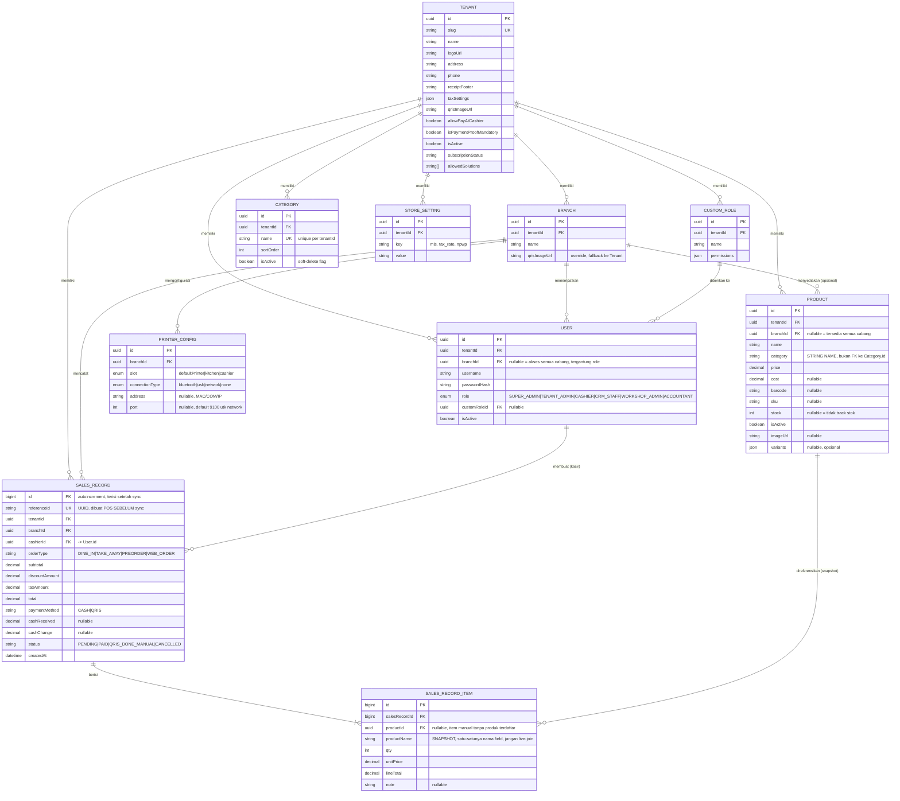

# 🗂️ ENTITY RELATIONSHIP DOCUMENT (ERD)
## Goldenity POS V2 — Fase 1: Auth, Inventory, Sales, Printer Settings

**Versi:** 1.0 · **Database:** PostgreSQL via Prisma ORM
**Scope:** Hanya entitas yang dibutuhkan Fase 1 (Auth, Inventory, Sales, Printer). Entitas Web Order/Bridge sengaja tidak dimasukkan.

---

## 1. Diagram ER (Mermaid)



## 2. Prisma Schema Lengkap

```prisma
// ─────────────────────────────────────────────────────────
// EPIC 1 — Auth & Multi-Tenant Core
// ─────────────────────────────────────────────────────────

model Tenant {
  id                      String       @id @default(uuid())
  slug                    String       @unique
  name                    String
  logoUrl                 String?
  address                 String?
  phone                   String?
  receiptFooter           String?
  taxSettings             Json?        // { enabled: bool, rate: number, pricesIncludeTax: bool }
  qrisImageUrl            String?      // kolom disiapkan untuk backlog fitur, belum dipakai UI Fase 1
  allowPayAtCashier       Boolean      @default(true)
  isPaymentProofMandatory Boolean      @default(false) // kolom disiapkan untuk backlog fitur
  isActive                Boolean      @default(true)
  subscriptionStatus      String?
  allowedSolutions        String[]
  branches                Branch[]
  users                   User[]
  customRoles             CustomRole[]
  categories              Category[]
  products                Product[]
  salesRecords            SalesRecord[]
  storeSettings           StoreSetting[]
  createdAt               DateTime     @default(now())
  updatedAt               DateTime     @updatedAt
}

model Branch {
  id            String          @id @default(uuid())
  tenantId      String
  name          String
  qrisImageUrl  String?
  tenant        Tenant          @relation(fields: [tenantId], references: [id])
  users         User[]
  products      Product[]
  salesRecords  SalesRecord[]
  printerConfigs PrinterConfig[]
  createdAt     DateTime        @default(now())

  @@index([tenantId])
}

enum UserRole {
  SUPER_ADMIN
  TENANT_ADMIN
  CASHIER
  CRM_STAFF
  WORKSHOP_ADMIN
  ACCOUNTANT
}

model User {
  id           String      @id @default(uuid())
  tenantId     String
  branchId     String?
  username     String
  passwordHash String
  role         UserRole
  customRoleId String?
  isActive     Boolean     @default(true)
  tenant       Tenant      @relation(fields: [tenantId], references: [id])
  branch       Branch?     @relation(fields: [branchId], references: [id])
  customRole   CustomRole? @relation(fields: [customRoleId], references: [id])
  salesRecords SalesRecord[] @relation("CashierSales")
  createdAt    DateTime    @default(now())

  @@unique([tenantId, username])
  @@index([branchId])
}

model CustomRole {
  id          String @id @default(uuid())
  tenantId    String
  name        String
  permissions Json   // { "products.write": true, "sales.refund": false, ... }
  tenant      Tenant @relation(fields: [tenantId], references: [id])
  users       User[]

  @@unique([tenantId, name])
}

// ─────────────────────────────────────────────────────────
// EPIC 2 — Inventaris & Kategori
// ─────────────────────────────────────────────────────────

model Category {
  id        String   @id @default(uuid())
  tenantId  String
  name      String
  sortOrder Int      @default(0)
  isActive  Boolean  @default(true) // soft-delete flag
  tenant    Tenant   @relation(fields: [tenantId], references: [id])
  createdAt DateTime @default(now())

  @@unique([tenantId, name])
}

model Product {
  id         String   @id @default(uuid())
  tenantId   String
  branchId   String?  // null = tersedia di semua cabang
  name       String
  category   String   // ⚠️ STRING NAME, bukan FK — lihat BRD §5 Epic 2 & catatan di bawah
  price      Decimal
  cost       Decimal?
  barcode    String?
  sku        String?
  stock      Int?     // null = tidak track stok
  isActive   Boolean  @default(true)
  imageUrl   String?
  variants   Json?
  tenant     Tenant   @relation(fields: [tenantId], references: [id])
  branch     Branch?  @relation(fields: [branchId], references: [id])
  items      SalesRecordItem[]
  createdAt  DateTime @default(now())
  updatedAt  DateTime @updatedAt

  @@index([tenantId, category])
  @@index([barcode])
}

// ─────────────────────────────────────────────────────────
// EPIC 3 — Alur Penjualan
// ─────────────────────────────────────────────────────────

model SalesRecord {
  id             BigInt   @id @default(autoincrement())
  referenceId    String   @unique // UUID dibuat di POS SEBELUM sync — cegah duplikasi transaksi offline-retry
  tenantId       String
  branchId       String
  cashierId      String
  orderType      String   // DINE_IN | TAKE_AWAY | PREORDER | WEB_ORDER
  subtotal       Decimal
  discountAmount Decimal  @default(0)
  taxAmount      Decimal  @default(0)
  total          Decimal
  paymentMethod  String   // CASH | QRIS
  cashReceived   Decimal?
  cashChange     Decimal?
  status         String   // PENDING | PAID | QRIS_DONE_MANUAL | CANCELLED
  tenant         Tenant   @relation(fields: [tenantId], references: [id])
  branch         Branch   @relation(fields: [branchId], references: [id])
  cashier        User     @relation("CashierSales", fields: [cashierId], references: [id])
  items          SalesRecordItem[]
  createdAt      DateTime @default(now())

  @@index([tenantId, branchId, createdAt])
  @@index([status])
}

model SalesRecordItem {
  id            BigInt      @id @default(autoincrement())
  salesRecordId BigInt
  productId     String?
  productName   String      // ⚠️ SATU-SATUNYA nama field snapshot — lihat Anti-Pattern #4 di BRD §8
  qty           Int
  unitPrice     Decimal
  lineTotal     Decimal
  note          String?
  salesRecord   SalesRecord @relation(fields: [salesRecordId], references: [id])
  product       Product?    @relation(fields: [productId], references: [id])

  @@index([salesRecordId])
}

// ─────────────────────────────────────────────────────────
// EPIC 4 — Printer & Pengaturan Perangkat Keras
// ─────────────────────────────────────────────────────────

model StoreSetting {
  id       String @id @default(uuid())
  tenantId String
  key      String // mis. "tax_rate", "npwp" — fallback generic KV kalau field dedicated di Tenant belum diisi
  value    String
  tenant   Tenant @relation(fields: [tenantId], references: [id])

  @@unique([tenantId, key])
}

enum PrinterSlot { defaultPrinter kitchen cashier }
enum PrinterConnectionType { bluetooth usb network none }

model PrinterConfig {
  id             String                @id @default(uuid())
  branchId       String
  slot           PrinterSlot
  connectionType PrinterConnectionType @default(none)
  address        String?               // MAC (bluetooth) / COM port (usb) / IP (network)
  port           Int?                  // default 9100 untuk network
  branch         Branch                @relation(fields: [branchId], references: [id])

  @@unique([branchId, slot])
}
```

## 3. Catatan Desain Kunci (WAJIB dipahami sebelum implementasi)

1. **`Product.category` string, bukan relasi FK ke `Category.id`.** Ini bukan technical debt — ini keputusan desain V1 yang sengaja dipertahankan agar POS Native bisa membuat produk baru secara offline tanpa harus sudah punya daftar kategori terbaru dari server. Backend WAJIB implementasi `resolveProductCategoryName(tenantId, categoryName)` yang auto-create `Category` kalau namanya belum ada (case-insensitive match) saat produk disinkronkan.
2. **Rename kategori WAJIB propagate.** Karena relasi berbasis nama, mengubah `Category.name` harus bulk-update semua `Product.category` yang match nama lama.
3. **`SalesRecord.referenceId`** adalah kunci rekonsiliasi offline-first — dibuat di client (POS) sebagai UUID SEBELUM ada baris tersimpan di server. Endpoint create-sale WAJIB idempotent terhadap `referenceId` (kalau retry dengan `referenceId` sama, jangan insert dobel).
4. **`SalesRecordItem.productName`** adalah SATU-SATUNYA nama field untuk snapshot nama produk di seluruh pipeline (cart → payload checkout → insert backend → print worker). Dilarang ada field alternatif (`rawProductName`/`product_name`/`name`) dengan priority-chain fallback — ini akar bug berulang di V1.5.
5. **`PrinterConfig` per `(branchId, slot)`** — kalau baris untuk `slot=kitchen` atau `slot=cashier` tidak ada / `connectionType=none`, resolver hardware WAJIB fallback ke baris `slot=defaultPrinter` milik branch yang sama.
6. **Kolom backlog** (`Tenant.qrisImageUrl`, `Tenant.isPaymentProofMandatory`) sengaja sudah ada di skema sejak Fase 1 supaya migrasi Fase 2 (Web Order) tidak perlu ALTER TABLE lagi — tapi TIDAK ADA logic/UI yang memakainya di Fase 1.
