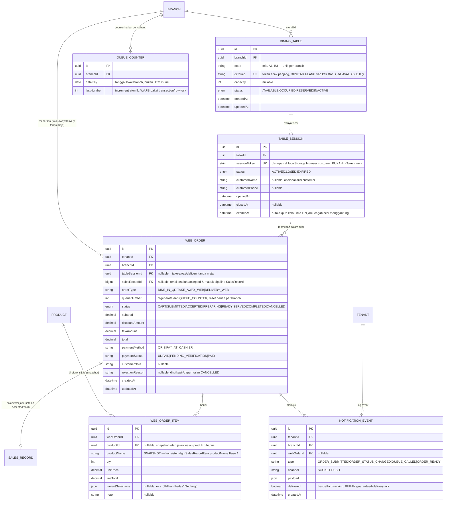

# 🗂️ ENTITY RELATIONSHIP DOCUMENT (ERD)
## Goldenity POS V2 — Fase 2: Web Order, Manajemen Meja/QR, Queue & Notifikasi

**Versi:** 0.2 (Semua pertanyaan terbuka di Bagian 4 sudah dijawab 2026-09-05 — scope Fase 2 awal: DINE_IN_QR saja, tanpa delivery/KDS)
**Database:** PostgreSQL via Prisma ORM — **menambah** ke schema Fase 1 (`ERD_POS_V2_FASE1.md`), bukan menggantikan.
**Prasyarat:** Sesuai `MASTER_BLUEPRINT_V2.md` §Scope, Web Order & Bridge sengaja DIKELUARKAN dari Fase 1 dan "akan didesain ulang terpisah setelah POS Native + Backend end-to-end solid". Dokumen ini adalah desain fase terpisah tersebut — **implementasinya sebaiknya menunggu Fase 1 (POS Native inti) benar-benar stabil di produksi**, bukan dikerjakan paralel saat fondasi masih ada bug aktif (lihat PROJECT_LOG.md untuk status terkini).

---

## 1. Diagram ER (Mermaid)



## 2. Tambahan Prisma Schema (Fase 2)

```prisma
// ─────────────────────────────────────────────────────────
// EPIC 5 — Web Order, Manajemen Meja/QR, Queue & Notifikasi
// ─────────────────────────────────────────────────────────

enum TableStatus {
  AVAILABLE
  OCCUPIED
  RESERVED
  INACTIVE
}

model DiningTable {
  id         String        @id @default(uuid())
  branchId   String
  code       String        // "A1", "B3" — WAJIB unik per branch
  qrToken    String        @unique // di-rotate tiap kali status kembali ke AVAILABLE
  capacity   Int?
  status     TableStatus   @default(AVAILABLE)
  branch     Branch        @relation(fields: [branchId], references: [id])
  sessions   TableSession[]
  createdAt  DateTime      @default(now())
  updatedAt  DateTime      @updatedAt

  @@unique([branchId, code])
  @@index([branchId, status])
}

enum TableSessionStatus {
  ACTIVE
  CLOSED
  EXPIRED
}

model TableSession {
  id            String              @id @default(uuid())
  tableId       String
  sessionToken  String              @unique // disimpan di localStorage browser customer
  status        TableSessionStatus  @default(ACTIVE)
  customerName  String?
  customerPhone String?
  table         DiningTable         @relation(fields: [tableId], references: [id])
  webOrders     WebOrder[]
  openedAt      DateTime            @default(now())
  closedAt      DateTime?
  expiresAt     DateTime            // openedAt + N jam, dicek saat validasi request

  @@index([tableId, status])
}

model WebOrder {
  id              String    @id @default(uuid())
  tenantId        String
  branchId        String
  tableSessionId  String?
  salesRecordId   BigInt?   @unique
  orderType       String    // DINE_IN_QR | TAKE_AWAY_WEB | DELIVERY_WEB
  queueNumber     Int
  status          String    // CART | SUBMITTED | ACCEPTED | PREPARING | READY | SERVED | COMPLETED | CANCELLED
  subtotal        Decimal
  discountAmount  Decimal   @default(0)
  taxAmount       Decimal   @default(0)
  total           Decimal
  paymentMethod   String    // QRIS | PAY_AT_CASHIER
  paymentStatus   String    @default("UNPAID")
  customerNote    String?
  rejectionReason String?
  tenant          Tenant        @relation(fields: [tenantId], references: [id])
  branch          Branch        @relation(fields: [branchId], references: [id])
  tableSession    TableSession? @relation(fields: [tableSessionId], references: [id])
  salesRecord     SalesRecord?  @relation(fields: [salesRecordId], references: [id])
  items           WebOrderItem[]
  notifications   NotificationEvent[]
  createdAt       DateTime  @default(now())
  updatedAt       DateTime  @updatedAt

  @@index([branchId, status, createdAt])
  @@index([tableSessionId])
}

model WebOrderItem {
  id                String    @id @default(uuid())
  webOrderId        String
  productId         String?
  productName       String
  qty               Int
  unitPrice         Decimal
  lineTotal         Decimal
  variantSelections Json?
  note              String?
  webOrder          WebOrder  @relation(fields: [webOrderId], references: [id])
  product           Product?  @relation(fields: [productId], references: [id])

  @@index([webOrderId])
}

model QueueCounter {
  id         String   @id @default(uuid())
  branchId   String
  dateKey    DateTime @db.Date
  lastNumber Int      @default(0)
  branch     Branch   @relation(fields: [branchId], references: [id])

  @@unique([branchId, dateKey])
}

model NotificationEvent {
  id         String    @id @default(uuid())
  tenantId   String
  branchId   String
  webOrderId String?
  type       String    // ORDER_SUBMITTED | ORDER_STATUS_CHANGED | QUEUE_CALLED | ORDER_READY
  channel    String    // SOCKET | PUSH
  payload    Json
  delivered  Boolean   @default(false)
  tenant     Tenant    @relation(fields: [tenantId], references: [id])
  branch     Branch    @relation(fields: [branchId], references: [id])
  webOrder   WebOrder? @relation(fields: [webOrderId], references: [id])
  createdAt  DateTime  @default(now())

  @@index([branchId, createdAt])
}
```

## 3. Catatan Desain Kunci

1. **QR Code TIDAK menyimpan gambar** — cukup generate di sisi client dari URL `https://order.goldenity.app/{tenantSlug}/{branchId}/t/{qrToken}` pakai library QR generator ringan. Konsisten dengan pola `qrisImageUrl` yang sudah ada (itu memang gambar statis karena berasal dari bank/e-wallet, beda kasus dengan QR meja yang generated).
2. **`qrToken` di-rotate setiap meja kembali ke status `AVAILABLE`** (setelah sesi ditutup kasir) — mencegah customer lama yang masih menyimpan link/screenshot QR bisa membuka sesi baru di meja yang sudah dipakai orang lain. `sessionToken` di `TableSession` terpisah dari `qrToken` DiningTable — `qrToken` itu identitas meja permanen (sampai di-rotate), `sessionToken` itu identitas SESI SEKALI PAKAI yang disimpan di browser customer.
3. **`QueueCounter` WAJIB pakai transaction dengan row-lock (`SELECT ... FOR UPDATE` via Prisma `$transaction`)** saat increment `lastNumber` — ini titik rawan race condition kalau 2 customer submit order bersamaan dan dapat nomor antrian sama. Reset otomatis per hari per cabang via `dateKey`, bukan reset manual.
4. **`WebOrder` BUKAN pengganti `SalesRecord`** — begitu status jadi `ACCEPTED` (kasir/dapur konfirmasi terima order), sistem membuat `SalesRecord` baru (`orderType=WEB_ORDER`, reuse logic `createSale` Fase 1 yang sama persis, termasuk aturan idempotent `referenceId`) dan mengisi `WebOrder.salesRecordId`. Ini supaya SEMUA laporan keuangan/laba-rugi tetap satu sumber kebenaran (`SalesRecord`), tidak ada pipeline akuntansi kedua yang terpisah untuk Web Order.
5. **Real-time notification pakai Socket.IO Bridge** — sesuai catatan di `MASTER_BLUEPRINT_V2.md` §Alur Checkout, backend Fase 1 SUDAH direncanakan emit event `TRANSACTION_CREATED`/`INVENTORY_UPDATED` walau belum ada consumer. Fase 2 tinggal menambah event baru (`ORDER_SUBMITTED`, `ORDER_STATUS_CHANGED`, `QUEUE_CALLED`) lewat bridge yang sama — `NOTIFICATION_EVENT` table di atas adalah **log/audit trail**, bukan message queue utama (broadcast real-time tetap lewat Socket.IO, DB cuma mencatat riwayatnya untuk debug/analytics).
6. **`TableSession.expiresAt`** wajib dicek di setiap request dari sisi customer (bukan cuma dicek sekali saat scan) — sesi yang idle lebih dari N jam (rekomendasi: 3 jam, disesuaikan jam operasional tenant) otomatis dianggap `EXPIRED` walau belum di-`CLOSED` manual oleh kasir, supaya meja tidak "nyangkut" occupied selamanya kalau customer lupa checkout/pergi tanpa bilang kasir.
7. **`orderType` di `WebOrder` sengaja terpisah dari `orderType` string di `SalesRecord` Fase 1** (yang sudah punya nilai `DINE_IN|TAKE_AWAY|PREORDER|WEB_ORDER`) — begitu WebOrder dikonversi ke SalesRecord, `SalesRecord.orderType` diisi `WEB_ORDER` generik, sedangkan detail sumbernya (QR meja vs take-away web vs delivery) tetap bisa ditelusuri balik lewat relasi `WebOrder.salesRecordId`.

## 4. Keputusan (semua 4 pertanyaan sudah dijawab 2026-09-05 — lihat dampak skema di bawah)

1. ✅ **QRIS Web Order = static manual, BUKAN payment gateway otomatis.** Penjual upload 1 gambar QRIS (reuse `Tenant.qrisImageUrl`/`Branch.qrisImageUrl` yang SUDAH ADA di Fase 1 — **tidak perlu tabel/field baru**). Saat customer pilih metode QRIS di Web Order, gambar ini ditampilkan di layar (bisa di-tap untuk zoom fullscreen), customer transfer manual, lalu status `paymentStatus` tetap `PENDING_VERIFICATION` sampai kasir konfirmasi manual — pola ini SAMA PERSIS dengan `QRIS_DONE_MANUAL` yang sudah ada di `SalesRecord` Fase 1, tidak ada pipeline baru. **Dampak ke schema di atas: TIDAK ADA PERUBAHAN, `WebOrder.paymentMethod="QRIS_STATIC"` cukup pakai field yang sudah didesain.**
2. ✅ **Delivery: DI LUAR SCOPE untuk sekarang.** Fase 2 ini **HANYA `DINE_IN_QR`** (pesan dari meja via scan QR). `TAKE_AWAY_WEB` dan `DELIVERY_WEB` di skema Bagian 2 di atas **dikurangi dulu jadi backlog, JANGAN diimplementasikan Trae di iterasi pertama** — cukup sisakan `orderType` sebagai string bebas (bukan enum kaku) supaya gampang ditambah nanti tanpa migration lagi, tapi validasi BE/FE Fase 2-awal cukup terima `DINE_IN_QR` saja.
3. ✅ **KDS**: ditunda, fokus POS Native + Web Order dulu (sudah dicatat di atas).
4. ✅ **Notifikasi order masuk — ini bukan soal retensi log, ini soal PERILAKU notifikasi**, klarifikasi Anda: begitu Web Order masuk, POS Native (kasir) **WAJIB kirim notifikasi 2-3 kali** (retry, bukan sekali tembak) DAN notifikasi ini harus tetap muncul walau aplikasi POS **di-minimize** (baik di Windows Desktop maupun Android), lalu POS **otomatis mencetak Checker (tiket dapur) + Struk** memakai pipeline print yang sudah ada dari Fase 1 (`PrinterConfig` per slot, `receipt_generator.dart`).

   **Catatan teknis penting yang perlu Trae perhatikan** (bukan cuma "tinggal emit Socket.IO"): notifikasi yang harus tetap muncul saat aplikasi di-minimize BUKAN sekadar in-app banner — itu butuh integrasi ke **notifikasi level OS**: di Windows, pakai Windows Toast Notification (paket `windows_notification`/`local_notifier` Flutter, jalan dari background isolate/service yang tetap listen Socket.IO walau window di-minimize); di Android, karena OS bisa membekukan proses Flutter yang di-background, notifikasi reliable BUTUH **push notification (Firebase Cloud Messaging)**, bukan cuma Socket.IO yang aktif selama app foreground saja. Auto-print 2-3x retry juga perlu logic idempotent (jangan sampai retry notifikasi memicu print struk dobel) — pakai `WebOrder.id` sebagai kunci dedup print job, bukan retry notifikasi = retry print.

**Dampak ke Bagian 1-2 di atas**: hapus/tunda entity yang terkait delivery kalau ada (saat ini tidak ada entity khusus delivery, aman), `NOTIFICATION_EVENT.type` di skema cukup ditambah field `retryCount Int @default(0)` untuk lacak berapa kali sudah dikirim ulang. Draft field tambahan:

```prisma
model NotificationEvent {
  // ...field lain tetap sama seperti Bagian 2...
  retryCount Int @default(0)   // BARU: berapa kali notifikasi ini sudah di-retry (target 2-3x)
  printedAt  DateTime?         // BARU: timestamp auto-print Checker+Struk berhasil, null = belum/gagal print
}
```

ERD ini sekarang **cukup matang untuk mulai breakdown tahap kerja Trae** begitu Fase 1 (POS Native inti) stabil — tidak ada lagi pertanyaan terbuka yang mengubah struktur skema secara fundamental.
